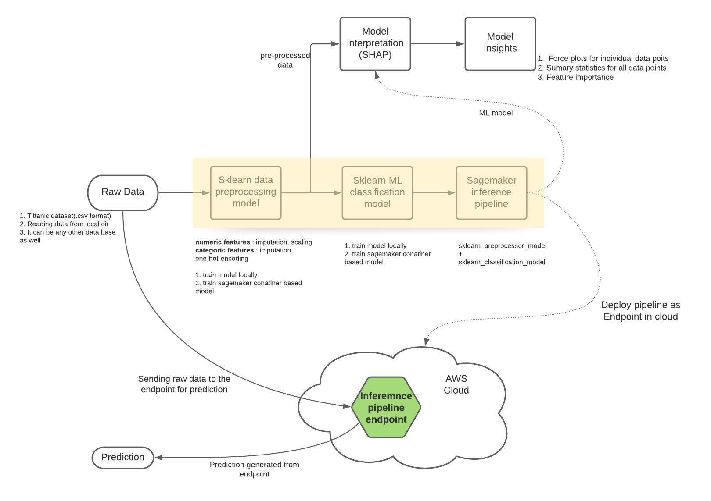

# Inference Pipeline using Scikit-learn model

## step 1 : build sklearn pipeline
Pipeline setup 
### 1. sklearn data pre-processor model
 * numeric : imputation, scaling
 * categoric : imputation, one-hot-encoding
 * also perform batch transformation of train/test data to be used for ml_model training
 
#### local training
Idea behind training sklearn model locally is to verify the model training script **pre_processing_script.py** and make sure that there are not any anomalies present in the script. 
*It will require raw data in local dir* 
This approach gives following benefits:
1. Time saving. Container based training take considerable amount of time.
2. Cost saving. Container based training is billable as per the selected instance.

#### container based training
- once local run is succesfull, train the sagemaker-container based model
- pre_processing_script.py is wokring fine
- train sklearn_preprocessor container

**setup** 
configure the training job 
Mention: 
1. entry_point : script name
2. train_instance_type : example "ml.c4.xlarge"

**training** 
*It will require raw data in S3 bucket*
launch container based model training
  

### 2. sklearn classification Model
train sklearn RandomforestClassifier model
#### local training
*It will require pre-processed data in local dir.* 
Training sklearn model locally, to verify the model training script **model_script.py** and make sure that there are not any anomalies present in the script. 

#### container based training
**setup** 
configure the training job 
Mention: 
1. entry_point : script name
2. train_instance_type : example "ml.c4.xlarge"

**training** 
*It will require raw data in S3 bucket* 
launch container based model training
  

  
## step 2 : Serial Inference Pipeline
* raw_data(S3) --> [preprocessing ==> ml_model] --> prediction
### setup
setup the PipelineModel:
Below trained container models are to be used in pipeline:
- pre-process transformer model 
- ml classification model 

### deploy endpoint
Mention: 
1. instance_type : 'ml.m4.xlarge' 
2. initial_instance_count : 1 
After this step we have successfully deployed ML inference pipeline as an Endpoint 

## step 3 : prediction using point
send raw data to the endpoint 
and get the prediction 

## step 4 : model insights
### retrieve model training artifacts
- pipeline model
- confusion matrix
- pr curve

### SHAP analysis
- Force plots for individual data points
- Summary statistics for all data points
- Feature importance