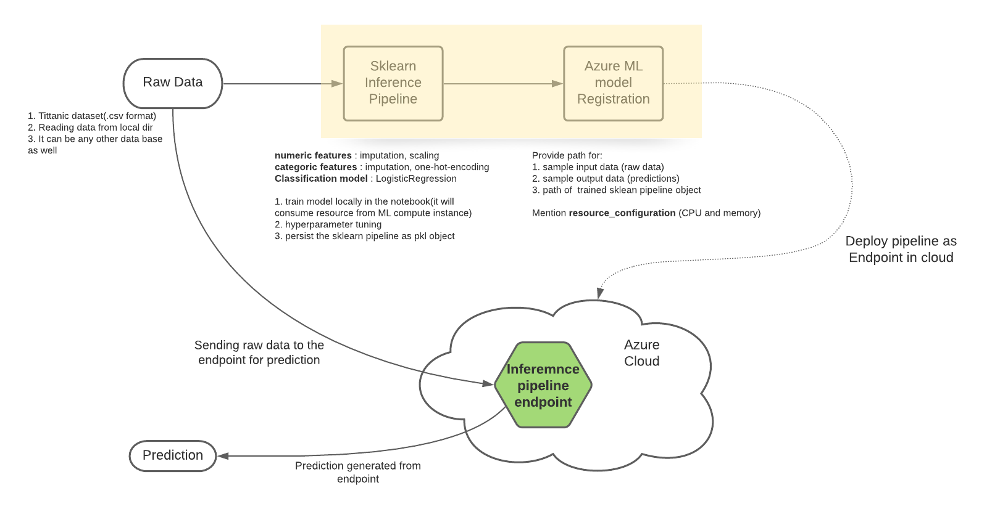

# Inference Pipeline using Scikit-learn model

## step 1 : build sklearn pipeline locally
Pipeline setup 
### Pipeline setup
 * numeric : imputation, scaling
 * categoric : imputation, one-hot-encoding
 * ml model : LogisticRegression
 
### Training
*code execution will consume the hardware from Azure ML compute instance* 
train the ml pipeline

### Tuning
hyperparameter tuning of ML pipeline

### Persist the pipeline
Once we achieved the satisfactory performance, persist the pipeline model as .pkl file

 
 
 
## step 2 : Deploy ML pipeline as endpoint 
### Artifacts registration
Register the artifacts required for model deployment
1. Sample input dataset
2. Sample output datasets
3. pipeline model
4. resource_configuration (cpu=1, memory_in_gb=0.5)

### Deployment
Deploy the model as an endpoint

## step 3 : prediction using point
send raw data to the endpoint 
and get the prediction 